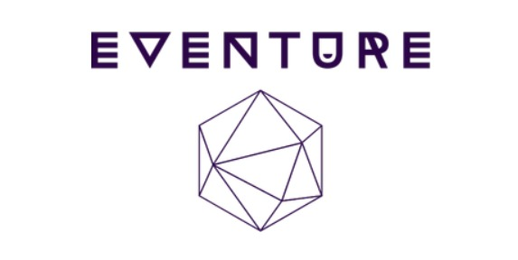
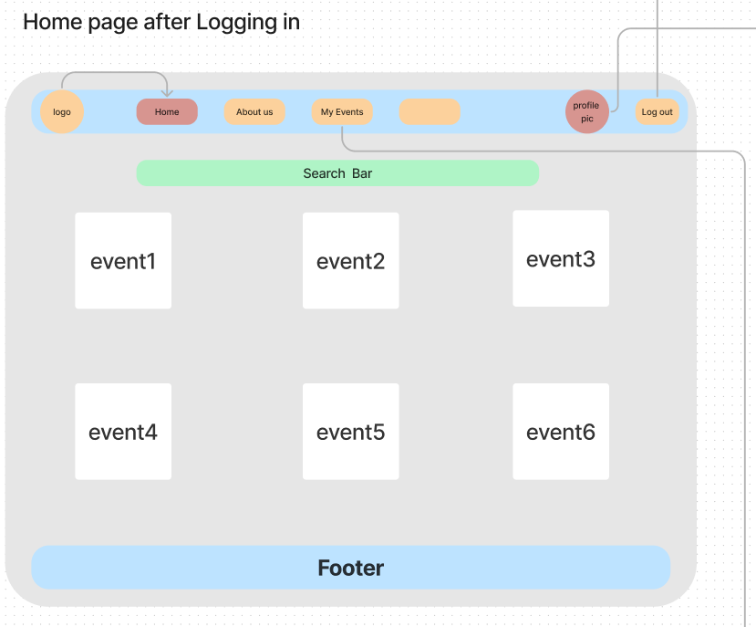
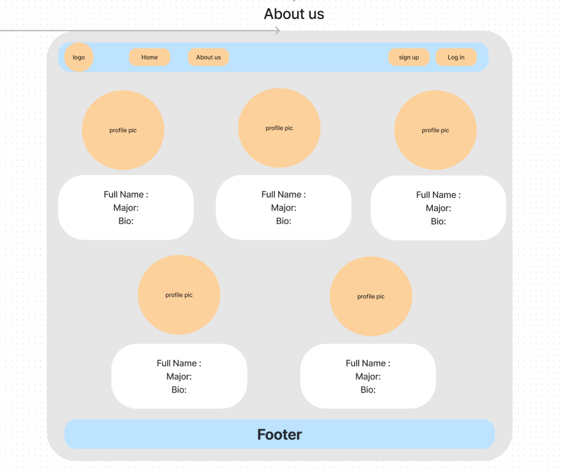
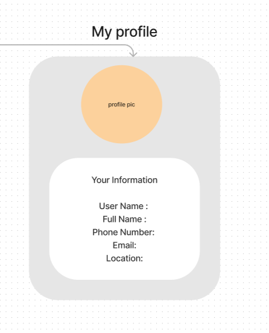
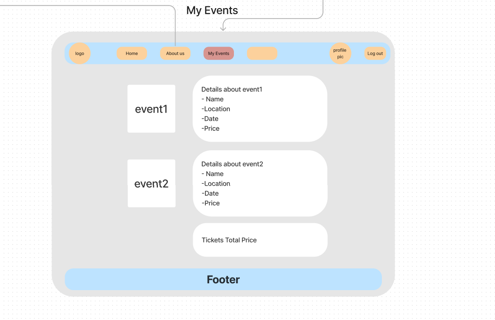

# Eventure
______
## Team Members 
 - Aws Al-omari. 
 - Balqees Al-Qudah.
 - Haya Hassan.
 - Reneh Mdanat. 
 - Saif Yahya.

## App Idea: Event Management System

The Event Management System is a web-based application built with Spring Boot that simplifies the process of organizing and managing events of all types, from concerts and festivals to sports events. The system provides event organizers, attendees, and administrators with a user-friendly platform to reserve, discover, and manage events seamlessly.

-------
## Why This App Is Useful:

  1. Provides event organizers with a convenient platform to manage events and sell tickets.
  2. Helps attendees discover and attend events of interest.
  3. Facilitates secure and efficient event registration and ticketing.
-------

## Key Features:

   1. **User Registration and Authentication:**
        Users can register and log in securely to access the system.
        Authentication and authorization mechanisms ensure data privacy and security.

   2. **Event Management:**
       
        Events can be categorized by type (e.g., conferences, concerts, sports, parties).

  3. **Event Discovery:**
        Users can browse and search for events based on location, date, artistName, avenueN and keywords.
        Users can view event details, including descriptions, schedules, and location maps.

  4. **Ticketing and Registration:**
        Attendees can purchase tickets online,and tickets are delivered via email or mobile app.
        or by cash.  
        QR code integration for easy event check-ins.

  5. **User Profiles:**
        Users can create and manage their profiles, including their usernames, full-names, phones numbers, and emails.

  6. **Admin Panel:**
     - Administrators can manage user accounts, events, and content.
     - Admins have access to cancel or approve any booking. 
     
  7. **Payment Integration:**
     - Tickets booked will be paid by cash at the nearest center that sells tickets. 
--------

## Prerequisites

  - Java Development Kit (JDK)
  - Spring Boot
  - Database (postgresSQL)
  - Gradle
  - IDE (IntelliJ IDEA)

_____

##  API-URL

 (https://www.jambase.com/jb-api/v1/events?apikey=357b5a27-55f2-487b-9b1c-83f6ad689c3e&page=1)

-----
## Trello Board 
https://trello.com/b/9xjMB2Cs/project

____
# WireFrames

### **Logo**

### **Home**
  - Home page before signing-up/ Logging in

    

  - Home page after Logging in

    

### **About us**

### **User profile**

### **User Events**

# User Stories

**User Story 1: Event Search by Location**

User Story: As a user, I want to search for events by location, so that I can find events happening in a specific area.

**Feature Tasks:**
- Implement a search bar for entering location criteria.
- Retrieve and display a list of events based on the entered location.
- Provide options to filter search results by date and event type.
- Acceptance Tests:
  1. Verify that events displayed match the entered location criteria.
  2. Ensure the search results can be filtered by date and event type.
  3. Confirm that the search bar functions correctly.

**User Story 2: Event Search by Artist**

User Story: As a user, I want to search for events by artist, so that I can find events featuring my favorite performers.

**Feature Tasks:**
- Implement a search bar for entering artist names.
- Retrieve and display a list of events featuring the specified artist.
- Provide options to filter search results by location and date.
- Acceptance Tests:
  1. Verify that events displayed feature the specified artist.
  2. Ensure the search results can be filtered by location and date.
  3. Confirm that the search bar functions correctly.

**User Story 3: Event Booking**

User Story: As a user, I want to be able to book tickets to events I'm interested in attending.

**Feature Tasks:**
- Implement a booking system that allows users to select the number of tickets and provide attendee details.
- Integrate a secure payment gateway for ticket purchases.
- Send a confirmation email to users after successful booking.
- Acceptance Tests:
  1. Verify that users can select the desired number of tickets and enter attendee information.
  2. Ensure that payments are processed securely.
  3. Confirm that users receive booking confirmation emails.

**User Story 4: Event Tracking**

User Story: As a user, I want to be able to track the events I've booked and receive updates about them.

**Feature Tasks:**
- Create a user dashboard that displays booked events and their details.
- Implement event reminder notifications via email or in-app notifications.
- Allow users to add events to their calendar.
- Acceptance Tests:
  1. Verify that the user dashboard displays booked events accurately.
  2. Ensure that event reminders are sent as specified by the user.
  3. Confirm that users can add events to their calendar.

**User Story 5: Event Recommendations**

User Story: As a user, I want to receive personalized event recommendations based on my preferences and past bookings.

**Feature Tasks:**
- Implement a recommendation algorithm that analyzes user activity and preferences.
- Display recommended events on the user's homepage.
- Provide options to customize and refine event preferences.
- Acceptance Tests:
  1. Verify that recommended events are relevant to the user's interests.
  2. Ensure that users can customize their event preferences.
  3. Confirm that recommended events are updated as user preferences change.

## Software Requirements
- Vision
  The vision of this product is to create a comprehensive and user-friendly web application for discovering, tracking, 
  and booking events in various countries. It aims to solve the pain point of users struggling to find up-to-date 
  information about events happening in different locations and provides a convenient solution for event enthusiasts.
  We care about this product because it enriches people's lives by connecting them with exciting events and experiences,
  fostering a sense of community, and simplifying the event discovery and booking process.

- Scope (In)
  IN - What the product will do:
  Event Discovery: The web app will provide information on a wide range of events, including concerts, music parties, 
  festivals, etc., across multiple countries.
  Event Search and Filtering: Users can search for events by location, artist, and event type, and filter results by 
  date and event category.
  Event Booking: Users can book tickets for events they are interested in attending, providing attendee details and 
  processing secure payments.
  Event Tracking: A user dashboard will display booked events, provide event reminders, and allow users to add events 
  to their calendars. Event Recommendations: The system will offer personalized event recommendations based on user 
  preferences and past bookings.

- Scope (Out)
  OUT - What the product will not do:
  Social Networking: The product will not have social networking features like user-to-user messaging or friend requests.
  Ticket Reselling: The platform will not support ticket reselling or scalping.

- Minimum Viable Product (MVP)
  The MVP functionality will include:
  Event Discovery and Search.
  Event Booking with basic user profiles.
  Event Tracking and Reminders.
  User Authentication and Authorization.

- Stretch Goals
  Social Integration: Allow users to share their booked events on social media.
  Event Reviews: Enable users to write and read reviews for events they attend.
  Event Chat: Implement a chat feature for attendees to communicate.
  Mobile App: Develop a mobile app version for iOS and Android.

- Data Flow
  User begins by entering search criteria (location, artist, event type) on the web app.
  The app processes the search request, fetching data from the events database.
  Search results are displayed to the user, who can then select an event.
  If the user chooses to book the event, they enter attendee details and proceed to payment.
  Payment information is securely processed, and a booking confirmation is sent.
  Booked events are added to the user's dashboard and calendar.
  Users receive event reminders and can share their experiences on social media.

- Non-Functional Requirements
  Security: Security will be a top priority, with measures such as data encryption, secure payment processing, and user
  authentication to protect user information and transactions.
  Usability: The application will have an intuitive and user-friendly interface, ensuring easy navigation and
  accessibility for a diverse user base. User experience testing will be conducted to refine usability.
  These non-functional requirements are crucial for safeguarding user data and ensuring a positive and accessible user 
  experience. Security measures will protect sensitive information, while usability testing will optimize the app's 
  interface for a broad audience.

