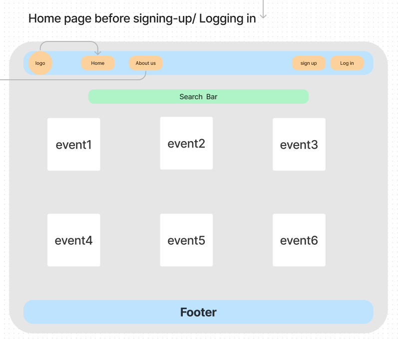

# Eventure

## App Idea: Event Management System

The Event Management System is a web-based application built with Spring Boot that simplifies the process of organizing and managing events of all types, from concerts and festivals to sports events. The system provides event organizers, attendees, and administrators with a user-friendly platform to reserve, discover, and manage events seamlessly.

-------
## Why This App Is Useful:

  1. Provides event organizers with a convenient platform to manage events and sell tickets.
  2. Helps attendees discover and attend events of interest.
  3. Facilitates secure and efficient event registration and ticketing.
-------

## Key Features:

   1. **User Registration and Authentication:**
        Users can register and log in securely to access the system.
        Authentication and authorization mechanisms ensure data privacy and security.

   2. **Event Management:**
       
        Events can be categorized by type (e.g., conferences, concerts, sports, parties).

  3. **Event Discovery:**
        Users can browse and search for events based on location, date, artistName, avenueN and keywords.
        Users can view event details, including descriptions, schedules, and location maps.

  4. **Ticketing and Registration:**
        Attendees can purchase tickets online,and tickets are delivered via email or mobile app.
        or by cash.  
        QR code integration for easy event check-ins.

  5. **User Profiles:**
        Users can create and manage their profiles, including their usernames, full-names, phones numbers, and emails.

  6. **Admin Panel:**
     - Administrators can manage user accounts, events, and content.
     - Admins have access to cancel or approve any booking. 
     
  7. **Payment Integration:**
     - Tickets booked will be paid by cash at the nearest center that sells tickets. 
--------

##  API-URL

 (https://www.jambase.com/jb-api/v1/events?apikey=357b5a27-55f2-487b-9b1c-83f6ad689c3e&page=1)

-----
# WireFrames

### **Logo**

### **Home**
  - Home page before signing-up/ Logging in

    

  - Home page after Logging in

    

### **About us**

### **User profile**

### **User Events**

